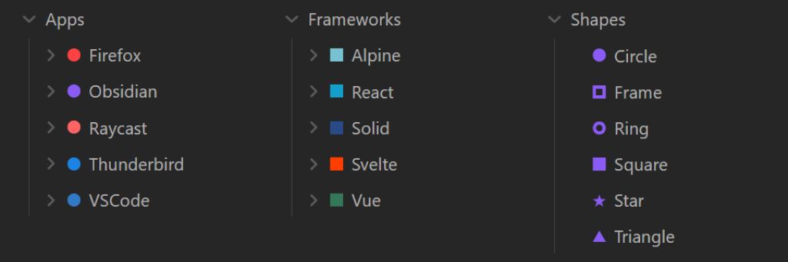
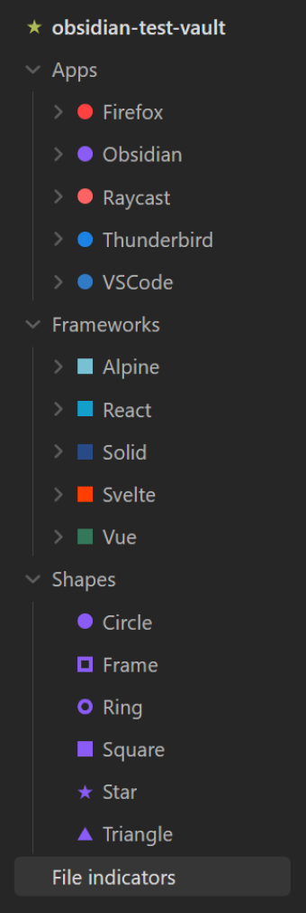

# Obsidian File Indicators

Add costum indicators to the file explorer.

This plugin lets you add indicators in custom colors and different shapes to all your files and folders.

## How to use

Right click on any file or folder and select `Add indicator`.

**Or**

Go to the `File indicator` plugin settings and select `Add indicator`.

This way you can even set an indicator at root level:

## How to install

1. Select `Settings`.
2. Select `Community plugins`.
3. Make sure `Restricted mode` is turned **off**.
4. Select `Browse` under `Community plugins`.
5. Search for and select the `File indicators` plugin.
6. Select `install`.
